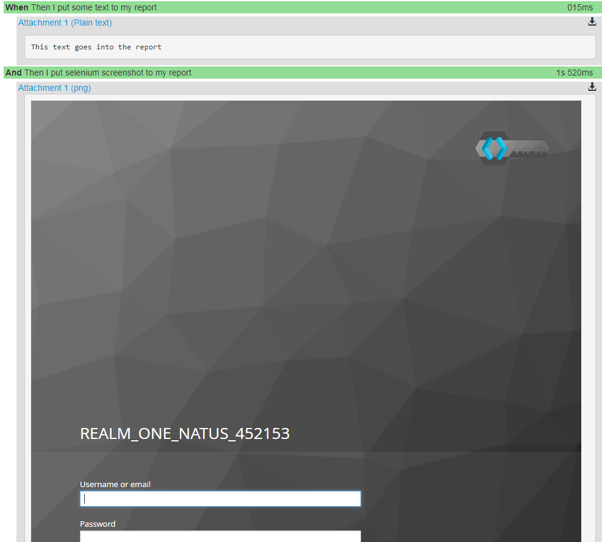

Tutorial
========

This chapter covers the whole Tutorial about radish and its features.

Feature files
-------------

All tests are written in so-called *feature files*. Feature files are plain text files ending with *.feature*.
A feature file can contain only one BDD *Feature* written in a natural language format called Gherkin.
However, radish is able to run one or more feature files. The feature files can be passed to radish as arguments:

.. code:: bash

   radish features/
   radish features/SumNumbers.feature features/DivideNumbers.feature
   radish features/unit features/functional

Feature
-------

A Feature is the main part of a *feature file*. Each feature file must contain exactly one *Feature*.
This Feature should represent a test for a single feature in your software similar to a test class in your unit code tests.
The *Feature* is composed of a *Feature sentence* and a *Feature description*.
The feature sentence is a short precise explanation of the feature which is tested with this *Feature*.
The feature description as a more verbose explanation of the feature which is tested. There you can answer the *Why* and *What* questions.
A *Feature* has the following syntax:

.. code:: cucumber

   Feature: <Feature sentence>
       ... Feature description
       on multiple lines ...

A Feature must contain one or more *Scenarios* which are run when this feature file is executed.

.. code:: cucumber

   Feature: <Feature sentence>
       ... Feature description
       on multiple lines ...

       Scenario: <Scenario 1 sentence>
           ... Steps ...

       Scenario: <Scenario 2 sentence>
           ... Steps ...

Scenario
--------

A Scenario is located inside a *Feature*.
You can think of a Scenario as of a standalone test case for the feature you want to test.
A Scenario contains one or more Steps. Each Scenario must have a unique sentence inside a *Feature*.

.. code:: cucumber

   Feature: My Awesome Feature
       In order to document
       radish I write this feature.

       Scenario: Test feature
           ... Some Steps ...

       Scenario: Test feature with a bad case test
           ... Some Steps ...

Scenario Outline
----------------

A Scenario Outline is a more advanced version of a standard Scenario. It allows you to run a Scenario multiple times with different input values. A *Scenario Outline* is defined with *Examples*. The Scenario is run with the input data from each *Example*. The data from the Example can be accessed in a Scenario with the name of the data inside < and >. For example see the following *Scenario Outline* which divides multiple numbers from the *Examples*:

.. code:: cucumber

   Feature: Test dividing numbers
       In order to test the
       Scenario Outline features of
       radish I test dividing numbers.

       Scenario Outline: Divide Numbers
           Given I have the number <number1>
           And I have the number <number2>
           When I divide them
           Then I expect the result to be <result>

       Examples:
           | number1 | number2 | result |
           | 10      | 2       | 5      |
           | 6       | 3       | 2      |
           | 24      | 8       | 3      |

Note: a PIPE (|) character within a *Examples* cell can be escaped with a backslash (\).

Scenario Outlines can also be use within the step text. An example is shown in the following *Scenario Outline*:

.. code:: cucumber

   Feature: Test dividing numbers
        with using the step text in to test the
        Scenario Outline features of
        radish I test dividing numbers.

        Scenario Outline: Divide Numbers
          Given I have following numbers
          """
            n1:<number1>,
            n2:<number2>
          """
          When I divide them
          Then I expect the result
          """
            result:<result>
          """

        Examples:
            | number1 | number2 | result |
            | 10      | 2       | 5      |
            | 6       | 3       | 2      |
            | 24      | 8       | 3      |

Scenario Loop
-------------

A Scenario Loop is a standard Scenario which is repeated for a given amount of iterations. *Scenario Loops* can often be useful when stabilization tests are performed in a CI environment.
Scenario Loops have the following syntax:

.. code:: cucumber

   Feature: My Awesome Feature
       In order to document
       radish I write this feature.

       Scenario Loop 10: Some stabilization test
           ... Some Steps ...

*Note: Scenario Loops are not standard gherkin*

Scenario Precondition
---------------------

Sometimes it can be very useful to reuse specific Scenarios. That's why we've decided to implement *Scenario Preconditions* in radish even though it's not common for a BDD tool. Before you start using *Scenario Preconditions* you should really think about the reason why you are using it. Behavior Driven Development Scenarios should be as short and concise as possible without a long list of dependencies. But there will always be these edge cases where it really makes sense to have a precondition for your Scenario.
Every Scenario can be used as a Precondition Scenario. *Scenario Preconditions* are implemented as special tags:

.. code:: cucumber

   Feature: My Awesome Feature
       In order to document
       radish I write this feature.

       @precondition(SomeFeature.feature: An awesome Scenario)
       Scenario: Do some crazy stuff
           When I add the following users to the database
               | Sheldon | Cooper |
           Then I expect to have 1 user in the database

radish will import the Scenario with the sentence ``An awesome Scenario`` from the feature file ``SomeFeature.feature`` and run it before the ``Do some crazy stuff`` Scenario. The following lines will be written:

.. code::

   Feature: My Awesome Feature
       In order to document
       radish I write this feature.

       @precondition(SomeFeature.feature: An awesome Scenario)
       Scenario: Do some crazy stuff
         As precondition from SomeFeature.feature: An awesome Scenario
           Given I setup the database
         From scenario
           When I add the following users to the database
               | Sheldon | Cooper |
           Then I expect to have 1 user in the database

As you can see radish will print some information about the Scenario where the Steps came from.
radish supports *multiple* and *nested* Scenario Preconditions, too. Recursions are detected and radish will print an appropriate error message.

If you have preconditions in a Scenario it's inconvenient to send it to your colleague or post it somewhere because you have multiple files. radish is able to resolve all preconditions and expand them to a single file.
Use the ``radish show --expand`` command to do so:

.. code::

   $ radish show --expand MyFeature.feature
   Feature: My Awesome Feature
       In order to document
       radish I write this feature.

       #@precondition(SomeFeature.feature: An awesome Scenario)
       Scenario: Do some crazy stuff
           Given I setup the database
           When I add the following users to the database
               | Sheldon | Cooper |
           Then I expect to have 1 user in the database

The information about the precondition is commented out.

*Note: Scenario Preconditions are not standard gherkin*

Background
----------

A *Background* is a special case of the Scenario. It's used to add some context to each Scenario of the same Feature.
You can think of it as a setup Scenario for the other Scenarios. It consists of one or more Steps in exactly the same way as
regular Scenarios. The *Background* is run **after** the *before hooks* of each Scenario but **before** the *Steps* of this Scenario.

A Background consists of an optional *short description* and Steps:

.. code-block:: gherkin

    Background: [optional short description]
        [zero or more Steps]

A simple Background might look like this:

.. code-block:: gherkin
   :emphasize-lines: 6

    Feature: Calculator Addition
        In order to support all four elementary
        binary operations the calculator shall
        implement the binary addition operator.

        Background:
            Given the calculator is started

        Scenario: Adding two positive integers
            Given the integer 5
            And the integer 2
            When the integers are added
            Then the sum is 7

Cucumber defined some useful `good practices for using backgrounds <https://github.com/cucumber/cucumber/wiki/Background#good-practices-for-using-background>`_. It's worth to read them carefully.

Steps
-----

The steps are the heart piece of every Feature file. A line in a *Scenario* is called *Step*. The steps are the only thing which are really executed in a test. A Step is written in a human readable language. Each step is parsed by radish and matched with a step implementation written in python. If a Step does not match any step implementation radish will raise an exception and abort the run.

All steps are implemented in python files located inside the *radish basedirs*. Per default this base directory points to *$PWD/radish*. However, the base directory location can be changed by specifying the *-b* option when triggering radish. You can also specify ``-b`` multiple times to load from multiple locations.
There are several ways how to implement steps. The most common way is by decorating your step implementation functions with one of the following decorators:

* @step(pattern)
* @given(pattern)
* @when(pattern)
* @then(pattern)

The difference between those four decorators is that for the *given*, *when* and *then* decorator the corresponding keyword is prefixed. For example ``@given("I have the number")`` becomes the pattern ``Given I have the number``.

A basic *steps.py* file with some step implementations could look like the following:

.. code:: python

  from radish import given, when, then

  @given("I have the number {number:g}")
  def have_number(step, number):
      step.context.numbers.append(number)

  @when("I sum them")
  def sum_numbres(step):
      step.context.result = sum(step.context.numbers)

  @then("I expect the result to be {result:g}")
  def expect_result(step, result):
      assert step.context.result == result

The first example of a *step implementation function* is always an object of type ``Step``.

Another way to implement step functions is using an enitre class:

.. code:: python

  from radish import steps

  @steps
  class Calculator(object):
      def have_number(self, step, number):
          """I have the number {number:g}"""
          step.context.numbers.append(number)

      def sum_numbres(self, step):
          """I sum them"""
          step.context.result = sum(step.context.numbers)

      def expect_result(self, step, result):
          """I expect the result to be {result:g}"""
          assert step.context.result == result

With the ``@steps`` decorator all methods of the given class are registered as steps. The step pattern is always the first line of the docstring of each method.
If a method inside the call is not a step implementation you can add the method name to the ``ignore`` attribute of this class:

.. code:: python

  from radish import steps

  @steps
  class Calculator(object):

      ignore = ["validate_number"]

      def validate_number(self, number):
          """Validate the given number"""
          ...

      def have_number(self, step, number):
          """I have the number {number:g}"""
          self.validate_number(number)
          step.context.numbers.append(number)

Step Pattern
------------

The pattern for each *Step* can be defined in two ways.
The default way is to specify the *Step pattern* in a format similar to the one used by python's ``str.format()`` method -
but in the opposite way. radish uses `parse_type <https://github.com/jenisys/parse_type>`_ to parse this pattern.
The pattern can be a simple string:

.. code:: python

   @given("I sum all my numbers")
   ...

This *Step pattern* doesn't have any arguments. To specify arguments use the ``{NAME:TYPE}`` format:

.. code:: python

   @given("I have the number {number:g}")
   def have_number(step, number):
       ...

The argument will be passed as keyword argument to the step implementation function with the specified name.
If no name is specified the arguments are positional:

.. code:: python

   @given("I have the numbers {:g} and {:g}")
   def have_numbers(step, number1, number2):
       ...

Per default the following *types* are supported:

+----------------+-------------------------------------------------------------------------------+-------------+
| Type           | Characters matched                                                            | Output type |
+================+===============================================================================+=============+
| w              | Letters and underscore                                                        | str         |
+----------------+-------------------------------------------------------------------------------+-------------+
| W              | Non-letter and underscore                                                     | str         |
+----------------+-------------------------------------------------------------------------------+-------------+
| s              | Whitespace                                                                    | str         |
+----------------+-------------------------------------------------------------------------------+-------------+
| S              | Non-whitespace                                                                | str         |
+----------------+-------------------------------------------------------------------------------+-------------+
| d              | Digits (effectively integer numbers)                                          | int         |
+----------------+-------------------------------------------------------------------------------+-------------+
| D              | Non-digit                                                                     | str         |
+----------------+-------------------------------------------------------------------------------+-------------+
| n              | Numbers with thousands separators (, or .)                                    | int         |
+----------------+-------------------------------------------------------------------------------+-------------+
| %              | Percentage (converted to value/100.0)                                         | float       |
+----------------+-------------------------------------------------------------------------------+-------------+
| f              | Fixed-point numbers                                                           | float       |
+----------------+-------------------------------------------------------------------------------+-------------+
| e              | Floating-point numbers with exponent e.g. 1.1e-10, NAN (all case insensitive) | float       |
+----------------+-------------------------------------------------------------------------------+-------------+
| g              | General number format (either d, f or e)                                      | float       |
+----------------+-------------------------------------------------------------------------------+-------------+
| b              | Binary numbers                                                                | int         |
+----------------+-------------------------------------------------------------------------------+-------------+
| o              | Octal numbers                                                                 | int         |
+----------------+-------------------------------------------------------------------------------+-------------+
| x              | Hexadecimal numbers (lower and upper case)                                    | int         |
+----------------+-------------------------------------------------------------------------------+-------------+
| ti             | ISO 8601 format date/time e.g. 1972-01-20T10:21:36Z (“T” and “Z” optional)    | datetime    |
+----------------+----------------------------------------------------------------+--------------+-------------+
| te             | RFC2822 e-mail format date/time e.g. Mon, 20 Jan 1972 10:21:36 1000           | datetime    |
+----------------+----------------------------------------------------------------+--------------+-------------+
| tg             | Global (day/month) format date/time e.g. 20/1/1972 10:21:36 AM 1:00           | datetime    |
+----------------+------------------------------------------------------------+------------------+-------------+
| ta             | US (month/day) format date/time e.g. 1/20/1972 10:21:36 PM 10:30              | datetime    |
+----------------+-------------------------------------------------------------------------------+-------------+
| tc             | ctime() format date/time e.g. Sun Sep 16 01:03:52 1973                        | datetime    |
+----------------+-----------------------------------------------------+-------------------------+-------------+
| th             | HTTP log format date/time e.g. 21/Nov/2011:00:07:11 +0000                     | datetime    |
+----------------+-------------------------------------------------------------------------------+-------------+
| ts             | Linux system log format date/time e.g. Nov 9 03:37:44                         | datetime    |
+----------------+-------------------------------------------------------------------------------+-------------+
| tt             | Time e.g. 10:21:36 PM -5:30                                                   | time        |
+----------------+-------------------------------------------------------------------------------+-------------+
| MathExpression | Mathematic expression containing: [0-9 +\-\*/%.e]+                            | float       |
+----------------+-------------------------------------------------------------------------------+-------------+
| QuotedString   | String inside double quotes ("). Double quotes inside the string can be       | text        |
|                | escaped with a backslash                                                      | w/o quotes  |
+----------------+-------------------------------------------------------------------------------+-------------+
| Boolean        | Boolean value:                                                                | bool        |
|                | True: 1, y, Y, yes, Yes, YES, true, True, TRUE, on, On, ON                    |             |
|                | False: 0, n, N, no, No, NO, false, False, FALSE, off, Off, OFF                |             |
+----------------+-------------------------------------------------------------------------------+-------------+

These standard types can be combined with the following cardinalities:

.. code:: text

    "{numbers:d}"     #< Cardinality: 1    (one; the normal case)
    "{number:d?}"     #< Cardinality: 0..1 (zero or one  = optional)
    "{numbers:d*}"    #< Cardinality: 0..* (zero or more = many0)
    "{numbers:d+}"    #< Cardinality: 1..* (one  or more = many)

If you accept one or more numbers for your step you could therefor do:

.. code:: python

    @given('I have the numbers {numbers:d+}')
    def have_numbers(step, numbers)
        ...

By default the ``,`` (comma) is used as a separator, but you are able to specify your own.
Let's assume you want to use ``and`` instead of ``,``:

.. code:: python

    from radish import custom_type, register_custom_type, TypeBuilder

    @custom_type('Number', r'\d+')
    def parse_number(text):
        return int(text)

    # register the NumberList type
    register_custom_type(NumberList=TypeBuilder.with_many(
        parse_number, listsep='and'))

Now you can use ``NumberList`` as the type in your step pattern.

As you've seen you can use the ``custom_type`` decorator, the ``register_custom_type`` function
and the ``TypeBuilder`` to extend the default types.
This could be useful to directly inject more advanced objects to the step implementations:

.. code:: python

   from radish import custom_type

   @custom_type("User", r"[A-Z][a-z]+ [A-Z][a-z]+")
   def user_type(text):
       """
        Return a user object by the given name
       """
       if text not in world.database.users:  # no user found
           return None

       return world.database.users[text]

This *custom type* can be used like this in the *Step pattern*:

.. code-block:: python

   from radish import then

   @then("I expect the user {user:User} has the email {}")
   def expect_user_has_email(step, user, expected_email):
       assert user.email == expected_email, "User has email '{0}'.
          Expected was email '{1}'".format(user.email, expected_email)

The ``TypeBuilder`` provides the following functionality:

: ``TypeBuilder.with_many(func[,listsep=','])`` :
    Extend the given parse function to accept multiple values of ``func``.
    See: https://github.com/jenisys/parse_type#cardinality
: ``TypeBuilder.with_optional(func)`` :
    Make the string parsed by ``func`` optional.
    See: https://github.com/jenisys/parse_type#cardinality
: ``TypeBuilder.make_enum(enum : dict)`` :
    Create a type for an enum represented by a ``dict``.
    See: https://github.com/jenisys/parse_type#enumeration-name-to-value-mapping
: ``TypeBuilder.make_choice(choices : list)`` :
    Create a type which accepts the values in the given list
    See: https://github.com/jenisys/parse_type#choice-name-enumeration
: ``TypeBuilder.make_variant(variants: list)`` :
    Create a type which can be one of the given types
    See: https://github.com/jenisys/parse_type#variant-type-alternatives

If these *Step patterns* do not fit all your use cases you could use your own **Regular Expression** to match a *Step sentence*:

.. code-block:: python

   from radish import then

   @then(re.compile(r"I expect the user ([A-Z][a-z]+ [A-Z][a-z]+|PENNY&LEONARD)+"))
   def complex_stuff(step, user):
       ...

The groups matched by the *Regular Expression* are passed to the *step implementation function*.

Step Behave like
----------------

Sometimes it could be useful to call another step within a step.
For example it could be useful if you want to change the interface
but still support the old steps or if you want to combine multiple steps
in one step.
This feature is called *behave like* and you can use it as the following:

.. code:: python

   @step("I want to setup the database")
   def setup_database(step):
       step.behave_like("I start the database server")
       step.behave_like("I add the system users to the database")
       step.behave_like("I add all roles to the database")

Step Tables
-----------

Step Tables are used to provide table-like data to a Step. The *Step Table* syntax looks similar to the *Scenario Outline Examples*:

.. code:: cucumber

   ...
   Scenario: Check database
       Given I have the following users
          | forename  | lastname | nickname  |
          | Peter     | Parker   | Spiderman |
          | Bruce     | Wayne    | Batman    |
       When I add them to the database
       Then I expect 2 users in the database

The *Step Table* can be accessed in the *Step Implementation function* through the ``step.table`` attribute which is a ``list`` of ``dict``:

.. code:: python

  from radish import given, when, then

  @given("I have the following users")
  def have_number(step):
    step.context.users = step.table

  @when("I add them to the database")
  def sum_numbres(step):
    for user in step.context.users:
        step.context.database.users.add(forename=user['firstname'], \
            lastname=user['lastname'], nickname=user['nickname'])

  @then("I expect {number:g} users in the database")
  def expect_result(step, number):
    assert len(step.context.database.users) == number

Step Text data
--------------

Like the *Step Tables* a Step can also get an arbitrary text block as input.
The syntax to pass text data to a *Step* looks like this:

.. code:: cucumber

   ...
   Scenario: Test quote system
      Given I have the following quote
          """
          To be or not to be
          """
      When I add it to the database
      Then I expect 1 quotes in the database

To access this text data you can use the ``text`` attribute on the ``step`` object:

.. code:: python

  from radish import given, when, then

  @given("I have the following quote")
  def have_quote(step):
      step.context.quote = step.text

  @when("I add it to the database")
  def add_quote_to_db(step):
          step.context.database.quotes.append(step.context.quote)

  @then("I expect {number:g} quote in the database")
  def expect_amount_of_quotes(step, number):
      assert len(step.context.database.quotes) == number

Note: Variables from a Scenario Outline are replaced in the step text.

Skipping a Step
---------------

In some situations it might be required to skip a step under certain conditions.
For e.g. ;

.. code:: cucumber

    ...
    Scenario: Test quote system
      Given I have the following quote in target DB
          """
          To be or not to be
          """
      When I found 2 quotes in the DB
      Then I delete one of them

To skip the step if `To be or not to be` quote could not be found:

.. code:: python

   from radish import given, when, then

   @given("I have the following quote in target DB")
   def have_quote_in_target_db(step):

       # code that would check the query in the DB

       if query is None:
            step.skip()
            return

       # Assuming this query includes data that we fetched from DB.
       # which might be a list of dictionaries.
       step.context.result = query

   @when("I found {number:g} quotes in the DB")
   def found_n_quotes_in_the_db(step, number):
        if not hasattr(step.context, "result"):
            step.skip()

        assert len(step.context.result) == number

        step.context.database.delete_id = step.context.result[0]['id']

   @then("I expect {number:g} quote in the database")
   def expect_amount_of_quotes(step, number):
       if not hasattr(step.context, "result"):
           step.skip()

       assert an_internal_function_to_delete_db_row(step.context.database.delete_id) is True

.. _tutorial#tags:

Tags
----

Tags are a way to group or classify Features and Scenarios.
Radish is able to only run Features or Scenarios with specific Tags.
Tags are declared with a similar syntax as decorators in python:

.. code:: cucumber

   @regression
   Feature: Some important feature
      In order to demonstrate
      the Tag feature in radish
      I write this feature.

      @good_case
      Scenario: Some good case test
          ...

      @bad_case
      Scenario: Some bad case test
          ...

**Note:** a Scenario inherits all tags of the Feature it is defined in!

When triggering radish you can pass the ``--tags`` command line option
followed by a tag expression. Tag expressions are parsed with
`tag-expressions <https://github.com/timofurrer/tag-expressions>`_.
Only these Features/Scenarios are ran.

Run all regression tests:

.. code:: bash

   radish features/ --tags regression

Run all *good case* or *bad case* tests:

.. code:: bash

   radish features/ --tags 'good_case or bad_case'

Constants
---------

Constants are specific *Tags* which define a constant which can be used in the *Steps*.
This could be useful when you have values which are used in several points in a Feature
and which should be named instead of appear as magic numbers.
A sample use-case I've seen is specifying a base temperature:

.. code:: cucumber

   @constant(base_temperature: 70)
   Feature: Test heater
      In order to test my
      heater system I write
      the following scenarios.

      Scenario: Test increasing the temperature
          Given I have the room temperature ${base_temperature}
          When I increase the temperature about 5 degrees
          Then I expect the temperature to be ${base_temperature} + 5

*Note: Constants are not standard gherkin*

.. _tutorial#terrain_and_hooks:

Terrain and Hooks
-----------------

In addition to the Step implementation radish provides the possibility to implement Hooks.
These Hooks are usually placed in a file called *terrain.py* inside the *base directory*.
Hooks can be used to setup and tear down the Features, Scenarios or Steps.
There are two different Hook types:

* ``before``
* ``after``

These can be combined with the following Hook subjects:

* ``all``
* ``each_feature``
* ``each_scenario``
* ``each_step``

Hooks can be registered by adding these Hook types and subjects as decorators to Python functions:

.. code:: python

   from radish import before

   from database import Database

   @before.each_scenario
   def connect_database(scenario):
      scenario.context.database = Database(name="foobar")
      scenario.context.database.connect()

The Python functions must accept the respective model object and in the case of ``all``
a second argument which is the radish run marker (a unique run id):

.. code:: python

   from radish import after

   @after.all
   def cleanup(features, marker):
      os.remove('foo')

Ordered Hooks
~~~~~~~~~~~~~

Sometimes it can be useful to explicitly order your Hooks instead of relying on the registration order.
Each Hook accepts an optional ``order: int`` keyword argument.
The Hooks are called in ascending order for all ``before`` Hooks and in descending order for all ``after`` Hooks.
So for example the following hooks:

.. code:: python

   from radish import before, after

   @before.each_step(order=2)
   def before_second(step):
      """Will be called as second before hook for each step"""
      print("BEFORE: 2nd")

   @after.each_step(order=2)
   def after_second(step):
      """Will be called as second after hook for each step"""
      print("AFTER: 2nd")

   @before.each_step(order=1)
   def before_first(step):
      """Will be called as first before hook for each step"""
      print("BEFORE: 1st")

   @after.each_step(order=1)
   def after_first(step):
      """Will be called as first after hook for each step"""
      print("AFTER: 1st")

would yield the following output:

.. code::

   BEFORE: 1st
   BEFORE: 2nd
   AFTER: 2nd
   AFTER: 1st

The default order is ``100`` for every Hook and so the order
depends on the registration order of the Hook
which corresponds to the import and source code order.

Tagged Hooks
~~~~~~~~~~~~

If you are using :ref:`tutorial#tags` you can specify that a certain Hook is only
called for Features, Scenarios or Steps with the according tags.

.. code:: python

    from radish import after

    @after.each_scenario(on_tags='bad_case or crash')
    def cleanup(scenario):
        # do some heavy cleanup!
        pass

Contexts
--------

As you may have noticed: each Feature and Scenario has it's own context.
You can dynamically add attributes to this context.
All Steps in a Scenario have the same context.
This is the preferred way to share data between steps over the ``world`` object.

.. code:: python

   from radish import before, given

   @given("I have the number {number:g}")
   def have_number(step, number):
      # accessing Scenario specific context
      step.context.number = number

   @before.each_feature
   def setup(feature):
       # accessing Feature specific context
       feature.context.setup = True

.. _tutorial#world:

World
-----

The ``world`` is a "global" radish context. It is used by radish to store the
configuration and other utility functions. It can be accessed by importing it
from the ``radish``. The ``world`` object is a `threadlocal` object  so it is
safe to use in threads.

You should not be using ``world`` to store data in scenarios and steps, that is
what `Contexts`_ are for.

The ``config`` attribute of world ``world`` contains a ``Configuration`` object
with named and positional arguments passed into radish. A basic transformation
is applied to each of the arguments to turn it into a python attribute:
As such "-" is replaced with "_", "--" is removed, and  "<" and ">" characters
are removed.

For example ``--bdd-xml`` argument can be accessed using
``world.config.bdd_xml``, and the argument ``<features>`` are accesses as
``world.config.features``.

.. code:: python

   from radish import world

   # print basedir
   print(world.config.basedir)

   # print profile
   print(world.config.profile)

Sometimes it's useful to have specific variables and functions available during
a whole test run. These variables and functions can be added to the ``world``
object:

.. code:: python

   from radish import world, pick
   import random

   world.x = 42

   @pick
   def get_magic_number():
       return random.randint(1, world.x)

The ``pick`` decorator adds the decorated function to the ``world`` object.
You can use this function later in a step implementation or another hook:

.. code:: python

   from radish import before, world

   from security import Tokenizer

   @before.each_scenario
   def gen_token(scenario):
      scenario.context.token = Tokenizer(world.get_magic_number())

.. _tutorial#bdd_xml_report:

BDD XML Report
--------------

Radish can report in the BDD XML format using ``--bdb-xml``.
The format of the XML is defined as follows:

**XML declaration**

.. code:: xml

  <?xml version='1.0' encoding='utf-8'?>

**<testrun>** is a top level tag

:agent:
  Agent of the test run composed of the user and hostname of the machine.
  Format: user@hostname
:duration:
  Duration of test run in seconds rounded to the 10 decimal points.
:starttime:
  Start time of the testrun run.
  Format: combined date and time representations, where date and time is separated by
  letter "T". Format: YYYY-MM-DDTHH:MM:SS
:endtime:
  End time of the testrun run.
  Format: combined date and time representations, where date and time is separated by
  letter "T". Format: YYYY-MM-DDTHH:MM:SS

example:

.. code:: xml

  <testrun>
    agent="user@computer"
    duration="0.0005660000"
    starttime="2017-02-18T07:06:55">
    endtime="2017-02-18T07:06:56"
  >

The **<testrun>** contains the following tags

**<feature>** tag

:id:
  Test run index id of the Feature. First feature to run is 1, second is 2 and
  so on.
:sentence:
  Feature sentence.
:result:
  Run state result of Feature run as described in
  :ref:`quickstart#run-state-result`
:testfile:
  Path to the file name containing the feature. The path is relative to
  the ``basedir``.
:duration:
  Duration of Feature run in seconds rounded to the 10 decimal points.
:starttime:
  Start time of the Feature run.
  Format: combined date and time representations, where date and time is separated by
  letter "T". Format: YYYY-MM-DDTHH:MM:SS
:endtime:
  End time of the Feature run.
  Format: combined date and time representations, where date and time is separated by
  letter "T". Format: YYYY-MM-DDTHH:MM:SS

example:

.. code:: xml

    <feature
      id="1"
      sentence="Step Parameters (tutorial03)"
      result="failed"
      testfile="./example.feature"
      duration="0.0008730000"
      starttime="2017-02-18T07:06:55"
      endtime="2017-02-18T07:06:55"
    >

The **<feature>** tag contains the following tags:

**<description>** tag:

:tag content: CDATA enclosed description of the feature.

.. code:: xml

  <description>
    <![CDATA[This feature test following functionality
    - awesomeness
    - more awesomeness
    ]]>
  </description>

**<scenarios>** tag:

Contains list of **<screnario>** tags

example:

.. code:: xml

  <scenarios>

The **<scenarios>** tag contains the following tags:

**<scenario>** tag:

:id:
  Test run index id of the Scenario. First scenario to run is 1, second is 2
  and so on.
:sentence:
  Scenario sentence.
:result:
  Run state result of Scenario run as described in
  :ref:`quickstart#run-state-result`
:testfile:
  Path to the file name containing the Scenario. The path is relative to
  the ``basedir``.
:duration:
  Duration of Scenario run in seconds rounded to the 10 decimal points.
:starttime:
  Start time of the Scenario run.
  Format: combined date and time representations, where date and time is separated by
  letter "T". Format: YYYY-MM-DDTHH:MM:SS
:endtime:
  End time of the Scenario run.
  Combined date and time representations, where date and time is separated by
  letter "T". Format: YYYY-MM-DDTHH:MM:SS

example:

.. code:: xml

  <scenario
    id="1"
    sentence="Blenders"
    result="failed"
    testfile="./example.feature"
    duration="0.0007430000"
    endtime="2017-02-18T07:06:55"
    starttime="2017-02-18T07:06:55"
  >

The **<scenario>** tag contains the following tags:

**<step>** tag:

:id:
  Test run index id of the Step. First Step to run is 1, second is 2
  and so on.
:sentence:
  Step sentence.
:result:
  Run state result of Step run as described in
  :ref:`quickstart#run-state-result`
:testfile:
  Path to the file name containing the Step. The path is relative to
  the ``basedir``.
:duration:
  Duration of Step run in seconds rounded to the 10 decimal points.
:starttime:
  Start time of the Step run.
  Format: combined date and time representations, where date and time is separated by
  letter "T". Format: YYYY-MM-DDTHH:MM:SS
:endtime:
  End time of the Step run.
  Format: combined date and time representations, where date and time is separated by
  letter "T". Format: YYYY-MM-DDTHH:MM:SS

example:

.. code:: xml

  <step
    id="1"
    sentence="Given I put &quot;apples&quot; in a blender"
    result="passed"
    testfile="./example.feature"
    duration="0.0007430000"
    endtime="2017-02-18T07:06:55"
    starttime="2017-02-18T07:06:55"
  >

The **<step>** MAY tag contains the following tags if error has occured:

**<failure>** tag:

:message:
  Test run index id of the Step. First Step to run is 1, second is 2
  and so on.
:type:
  Step sentence.
:tag content:
  CDATA enclosed failure reason specifically excepion traceback.

example:

.. code:: xml

   <failure message="hello" type="Exception">
      <![CDATA[Traceback (most recent call last):
        File "/tmp/bdd/_env36/lib/python3.6/site-packages/radish/stepmodel.py", line 91, in run
            self.definition_func(self, \*self.arguments)  # pylint: disable=not-callable
        File "/tmp/bdd/radish/radish/example.py", line 34, in step_when_switch_blender_on
          raise Exception("show off radish error handling")
      Exception: show off radish error handling
     ]]>
   </failure>

Cucumber json Report
--------------------
Radish can write cucumber json result file after run using --cucumber-json=<ccjson>.

With local tools like `Cucumber json report generator
<https://github.com/damianszczepanik/cucumber-sandwich>`_

    java -jar cucumber-sandwich.jar -n -f path/to/the/folder/containing/json -o path/to/folder/to/generate/reports/into

Or Jenkins `Cucumber Reports Plugin
<https://wiki.jenkins.io/display/JENKINS/Cucumber+Reports+Plugin>`_

You can simply generate Pretty HTML Reports for Cucumber

Embedding data in cucumber report
~~~~~~~~~~~~~~~~~~~~~~~~~~~~~~~~~
With radish it is simple to enrich your reports with additional text, html or image data

Here are few code examples:

.. code:: python

  @then("I put some text to my report")
  def put_text(step):
      step.embed("This text goes into the report")

  @then("I put selenium screenshot to my report")
  def put_selenium_screenshot(step):
      step.embed(context.web_driver.get_screenshot_as_base64(),
                 mime_type='image/png',
                 encode_data_to_base64=False)

  @then("I put page source to my report")
  def put_selenium_page_source(step):
      step.embed(context.web_driver.page_source,
                 mime_type='text/html')

Html report output screen example:

Testing Step Patterns
---------------------

*New since radish version v0.3.0*

Radish provides a nice way to test if the implemented step pattern (``@step(...)``) match the
expected sentences. This is especially useful if you provide a set of step implementations
and someone else is going to use them and implement the feature files.

In a way your step pattern are the interface of your step implementation and **interfaces ought to be tested properly**.

If you've installed radish a command called ``radish-test`` is available.
Install it's dependencies with:

.. code:: bash

    pip install radish-bdd[testing]

The ``matches`` sub command is used to test your step pattern inside your *base dirs* (``-b`` / ``--basedir``) against some
sentences defined in a YAML file. We call those files **match configs**. A *match config* file has the following format:

.. code:: yaml

    - sentence: <SOME STEP SENTENCE>
      should_match: <THE STEP FUNCTION NAME IT SHOULD MATCH>
      should_not_match: <THE STEP FUNCTION NAME IT SHOULD NOT MATCH>
      with_arguments:
        # argument check if implicit type
        - <ARGUMENT 1 NAME>: <ARGUMENT 1 VALUE>
        # argument check with explicit type
        - <ARGUMENT 2 NAME>:
            type: <ARGUMENT 2 TYPE NAME>
            value: <ARGUMENT 2 VALUE>
        # argument check with explicit type and type cast
        - <ARGUMENT 3 NAME>:
            type: <ARGUMENT 3 TYPE NAME>
            value: <ARGUMENT 3 VALUE>
            cast: yes
        # argument check with explicit type and using repr() for the value
        - <ARGUMENT 4 NAME>:
            type: <ARGUMENT 4 TYPE NAME>
            value: <ARGUMENT 4 VALUE>
            use_repr: yes

:sentence:
    **Required**. This is the sentence you want to test.
    It's an example of a sentence which should match
    a certain Step pattern.
:should_match:
    **Required if should_not_match omitted**. This is the name of the Python Step implementation
    function which you expect the sentence will match with.
:should_not_match:
    **Required if should_match omitted**. This is the name of a Python Step implementation
    function which you expect the sentence will **not** match with.
:with_arguments:
    **Optional for should_match**. This is a list of arguments which you expect
    will be passed in the python Step implementation function.
    The arguments can be specified as key-value pairs or as an object
    with a *type* and *value* and a boolean value *cast* and a *use_repr* flag.
    This could be useful if a custom argument expression
    is used to parse the arguments.
    The *use_repr* flag should be used when comparing with a user defined type.

Example
~~~~~~~

Let's assume we have the following ``step.py`` implementation:

.. code:: python

    from radish.stepregistry import step
    from radish import given, when, then

    @step("I have the number {number:g}")
    def have_number(step, number):
        step.context.numbers.append(number)

    @when("I sum them")
    def sum_numbers(step):
        step.context.result = sum(step.context.numbers)

    @then("I expect the result to be {result:g}")
    def expect_result(step, result):
        assert step.context.result == result

And a ``step-matches.yml`` file like this:

.. code:: yaml

    - sentence: Given I have the number 5
      should_match: have_number
      with_arguments:
          - number:
                type: float
                value: 5.0

    - sentence: When I sum them
      should_match: sum_numbers

    - sentence: When I divide them
      should_not_match: sum_numbers

    - sentence: When I do some weird stuff
      # if no step is given it shouldn't match any at all
      should_not_match:

    - sentence: Then I expect the result to be 8
      should_match: expect_result
      with_arguments:
          - result: 8.0

We can check the ``step.py`` implementation against the ``step-matches.yml`` match config file using the ``radish-test`` CLI application:

.. code:: bash

    radish-test matches tests/step-matches.yml

Due to the fact that the ``step.py`` module is located in ``$PWD/radish`` we don't have to specify it's location with ``-b`` or ``--basedir``.

For the ``radish-test`` call above we would get the following output:

.. code:: text

    Testing sentences from tests/step-matches.yml:
    >> STEP "Given I have the number 5" SHOULD MATCH have_number ✔
    >> STEP "When I sum them" SHOULD MATCH sum_numbers ✔
    >> STEP "When I divide them" SHOULD NOT MATCH sum_numbers ✔
    >> STEP "Then I expect the result to be 8" SHOULD MATCH expect_result ✔

    4 sentences (4 passed)
    Covered 3 of 3 step implementations

In case of success we get the exit code **0** and in case of failure we'd get an exit code which is greater than **0**.

``radish-test matches`` also supports step coverage measurements. Use ``--cover-min-percentage`` to let ``radish-test matches`` fail if a certain
coverage threshold is not met and use the ``--cover-show-missing`` command line option to list all not covered steps and their location.
